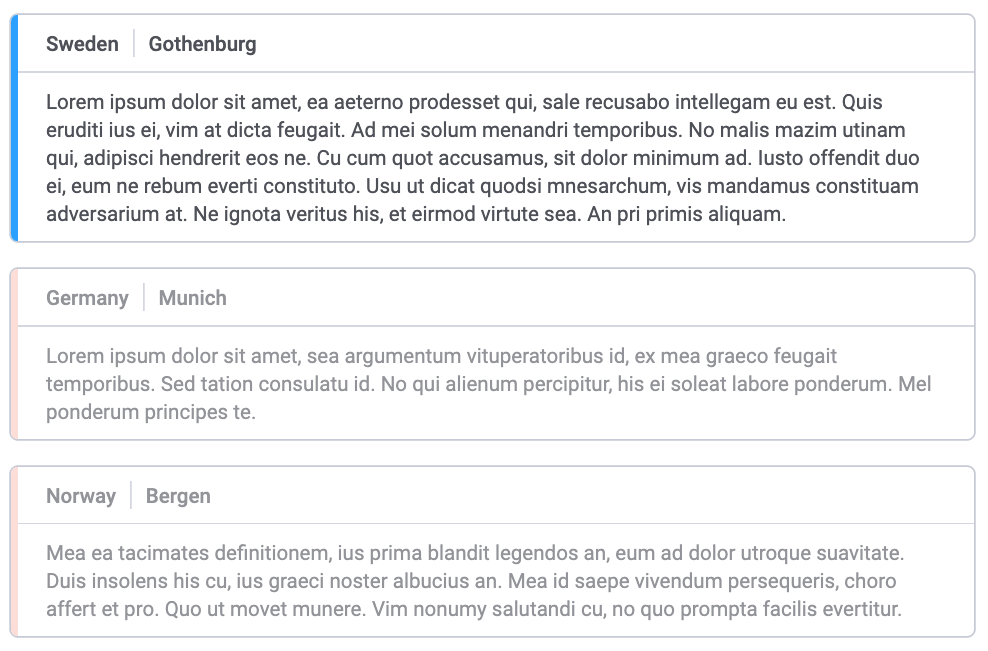

# Text mod

## Purpose

The Text Card mod for the TIBCO Spotfire environment is an extension used to visualize text data in an efficient and esthetical way, often alongside other data visualizations.

## Getting started

You want to start directly? Look [here](getting-started).

## Features

More details about the features can be found [here](features)

